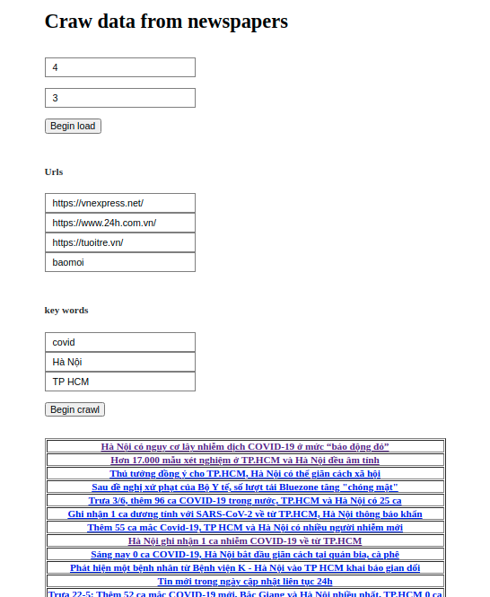
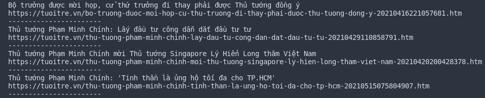

# Crawl-data-with-newspaper

## Description

1. Crawl information from some **URL** (of newspaper) and some **keywords**

1. Follow by step:

   - Search by the tool in google search with keywords and URL

   - Crawl HTML from URLs - search results

   - Load text content from HTML use multi-thread

   - Tokenizer text to words use NLP pre-train model

   ```Python
   Input: "Thủ tướng Phạm Minh Chính ra chỉ thị tập trung dập dịch"
   Output: ["Thủ tướng", "Phạm Minh Chính", "ra", "chỉ thị", "tập trung", "dập", "dịch"]
   ```

   - Ranking articles by keywords use keywords score

   ```Python
   @staticmethod
   def get_important_score(counter_keys, keys):
       score = 0
       for key in counter_keys.keys():
           for k in keys:
               if k == key.lower():
                   score += counter_keys[key]
       return score
   ```

   - Remove the similarity articles use a [bag of words](https://en.wikipedia.org/wiki/Bag-of-words_model) (vectorizer text engineering)

1. UI project

   

## Prerequisites

- run in ubuntu 20.04 or newer

- install python >= 3.8.5

  ```sh
  sudo apt-get update
  sudo apt-get install python3
  ```

- install pip

  ```sh
  sudo apt install -y python3-pip
  ```

## Installation

- Clone the repository

  ```sh
  git clone https://github.com/thaiph99/crawl-data-with-newspaper.git
  ```

- Install requirement packages

  ```sh
  pip install -r requirements.txt
  ```

## Usage

- Import lib

  ```Python
  from crawl.crawl_v2 import Keyword, News, Url
  ```

- Create process function

  ```Python
  def process(url, key):
    news = News()
    news.load_urls(url, key)
    url.standardized()
    key.standardized()
    news.load_text()
    news.load_key()
    news.load_score(key.list_keys)
    list_ans = news.list_score_news
    list_index = [_ for _ in range(len(list_ans))]
    dict_ans = dict(zip(list_ans, list_index))
    dict_ans = dict(sorted(dict_ans.items(), key=lambda x: -x[0])[:20])
    dict_res = {}
    for _, i in dict_ans.items():
        if _ == 0:
            break
        dict_res[news.list_title[i]] = (
            news.list_url_news[i], news.list_title[i])
    return dict_res
  ```

- Use function

  ```Python
  list_urls = ['https://vnexpress.net/',
          'https://www.24h.com.vn/',
          'https://tuoitre.vn/']

  list_keys = ['thủ tướng',
          'chính phủ',
          'Phạm Minh Chính']

  urls = Url(list_urls)
  keys = Keyword(list_keys)
  answer = process(urls, keys)

  for item in answer.items():
  print(item[0])
  print(item[1][0])
  print('-----------------------')
  ```

- Output
  

## Citation

- [Search tools for python](https://github.com/MarioVilas/googlesearch.git)
- [Get content from newspaper](https://github.com/codelucas/newspaper.git)
- [Vietnamese text tokenizer](https://github.com/trungtv/pyvi.git)

## Contact

Phạm Hồng Thái - [@thaiph99](https://fb.com/thaiph99) - thaiph99@gmail.com

Project Link: [https://github.com/thaiph99/crawl-data-with-newspaper.git](https://github.com/thaiph99/crawl-data-with-newspaper.git)
